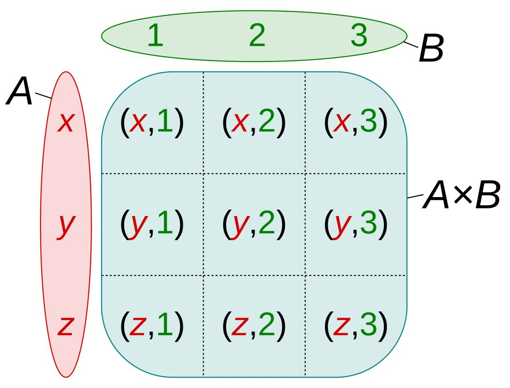
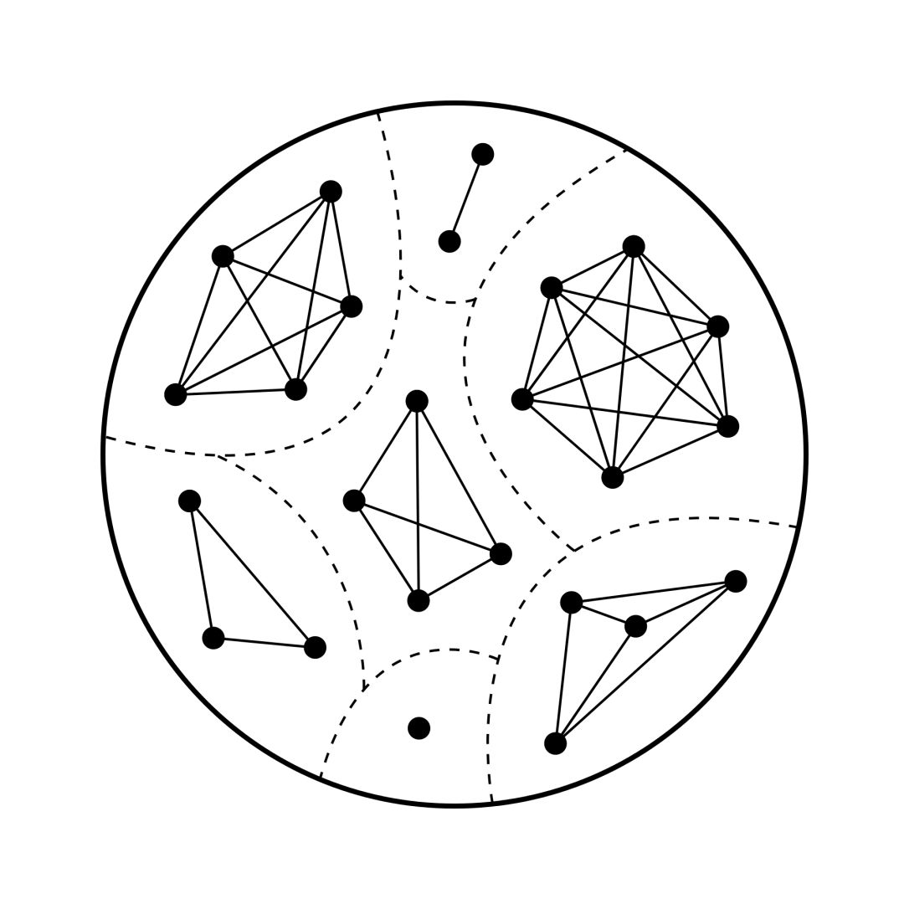
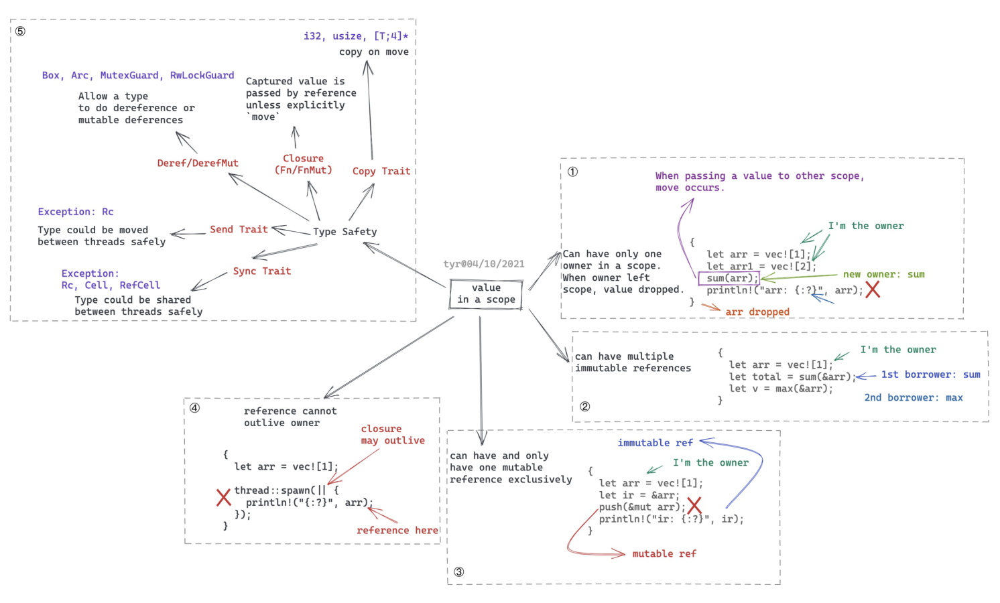

# 「透过 Rust 探索系统本原」 学习笔记

# 类型系统

[来源:程序人生公众号](http://mp.weixin.qq.com/s?__biz=MzA3NDM0ODQwMw==&mid=2649828208&idx=1&sn=1599b7cbc3bcc2c050c2689b9e46acbd&chksm=8704a96cb073207a890c0056332ede6ac01eda5f5bcc02ec016b466b0fb6b6c91c3637fee1c1&scene=21#wechat_redirect)

Rust 中是如何构建类型系统的呢？

1. 基本类型 (primitive type)
2. struct 通过 product type 笛卡尔积的方式组成
3. enum 通过 sum type 构成

## primitive type

primitive type，基本类型。
基本上每种编程语言都有：`integer，string，bool，array，list/vector` 等。

什么是类型？

对于 `u8` 来说，它是 `[0, 255]` 之间的一个整数，是一个集合，可以这么表述：`{ x | x ∈ [0, 255]}`。

对于 `String` 来说，它是任意字符串的一个集合，
`{x | x ∈ ["", "a", ..., "War and Pease", ...]}`。

所以，类型在数学上的意义是集合。

## product type

product type 是几乎所有编程语言都有的数据类型。

在 delphi,erlang 中是 record;
在 elixir，rust ，go 中是 struct;
在 javascript 中是 object;

### product type 数学上的意义

product type，顾名思义，是不同类型的乘积

假设 `x` 的定义域是集合 `int`，`y` 的定义域是集合 `string`，
`x * y` 展开便是 `(…, -2, -1, 0, 1, 2, …) * (“”, “a”, “ab”, “hello world”, …)`，
也就是说对于 `int` 里的任意一个值，都有 `string` 里的任意一个值与其配对，
这就是笛卡尔积 (Cartesian product)。



```rust
struct User {
  username: String,
  nickname: String,
  email: String,
  email_verified: bool,
}
```

这个 User 类型的集合的取值范围，就是它内部的所有类型的笛卡尔积。

## sum type

笛卡尔积固然能帮助我们构建各式各样的复合类型，但它无法描述这样的场景：
我们想为 User 添加一个 payment 的类型，它可以是信用卡，现金，微信，以及 ABT 其中的一种。自然，我们可以这样描述：

```rust
enum Payment {
  Creditcard,
  Cash,
  Wechat,
  Abt,
}
```

但这样的类型并不完备, 如果用户选择了信用卡，那么需要信用卡号，过期时间，持卡人等信息，
而选择 ABT，则需要钱包地址及其公钥。这该怎么办？我们需要类似于这样的类型：

```
Creditcard(CreditcardType) |
Cash(f64) |
... |
Abt(WalletType)
```

在集合论中，这被称作 disjoint union（不相交集），表述为 A + B。如图：


不相交集在数据类型中往往被称作 tagged union (C++) 或者 sum type (haskell, rust)。
和 product type 相反的是，大部分编程语言没有 sum type。
我们看 rust 是如何使用 sum type 来解决上面的问题的：

```rust
struct CreditcardInfo {
  number: String,
  expiration: chrono::NaiveDate,
  holder: String,
}

struct WalletType {
  address: String,
  pk: [u8; 32]
}

enum CreditcardType {
  Creditcard(CreditcardInfo),
  Cash(f64),
  Wechat(AccountInfo),
  Abt(WalletType)
}
```

sum type 的美妙之处是它解决了类型系统中基本类型和复合类型潜在的不够严谨的问题，比如说这样一个函数：
`fn div(x: f64, y: f64) -> f64 { x / y }`

从 type signature 上看，似乎没有问题，但在实现层面上，我们很快发现 x / y 有约束条件：y 不能是 0。
我们要么设计一种新的数据类型 `non_zero_f64` 把零从中排除出去（这在大多数语言里都很困难），
从输入的角度让这个函数的 type signature 完备；要么让返回的结果是一种特殊的类型，它可能是 f64，可能为空。

由于大多数语言不支持 sum type，这种情况就只好用两种方式来解决：

1. 函数的返回值可能是 f64，可能是 null。如果一门语言不支持异常，那么就只好检查一下输入，当为 0 时返回 null。
2. 函数的返回值依旧是 f64，但除零的时候会抛出异常。对于支持异常的语言，除了上一种方式，我们还可以抛出异常

第一种方式损害了类型的完备性，因为 type signature 不再有权威 —— 调用者不敢肯定自己一定会拿回一个 f64，
所以只好也做相应的条件判断，把这种对于类型的泄露一层层传递出去。第二种方式也是对类型完备性的一种损伤，
因为调用者需要知道并且选择处理或者不处理那些「意外」。因为意外不是返回类型的一部分，所以，额外的逻辑是必不可少的。

Scott Wlaschin 在他著名的 Railway Oriented Programming 里把一个又一个这样的情况拎出来寻求解决之道，
而 sum type，就是最佳的选择。

在 Rust 里，我们有类似于 Maybe Monad 的 Option：

```rust
enum Option<T> {
  Some(T),
  None
}
```

对于上面的函数，我们可以用 `Option<f64>` 来完善其 type signature:

`fn div(x: f64, y: f64) -> Option<f64>;`
当 y 为零，返回 None；不为零，返回 Some(x / y)。表面上看它似乎和上面第一种方式没有区别，
但一个形式化完备的类型让很多事情变成了可能。这个函数可以被 pipe，被 compose，
调用者不必担心类型的泄露 —— 所有信息都已经在 type signature 里面了，
编译器可以做更合适更严格的检查，也可以适当优化 —— 更重要的是，围绕着这个类型，
我们可以把一堆原本不断出现在用户代码中的对结果判断的 if else / try catch 抽象出来，
成为 Option 类型的一组 behavior，这样让用户代码变得清晰。

同样的思路，在 Rust 里，exception 被抛弃，取而代之的是是 Result，也是一个 sum type:

```rust
enum Result<T, E> {
  Ok(T),
  Err(E),
}
```

和 IO 的互动，和别人家的代码的互动，大家都可以通过 Result 来完成。
围绕着 Result，也有一组标准的 behavior 和宏，处理其结果。

## generics type

以 Option 类型来说事

```rust
enum Option<T> {
  Some(T),
  None
}
```

T 代表任意类型，Option 是 T 映射到这个 enum 的结果。所以换个角度，
我们可以认为泛型是作用在类型上的一种特殊的函数，
它接受一种或者多种类型，返回一种新的类型。
我们知道，编译器在处理具体的数据时会将泛型展开，
比如说 `Option<u8>` 展开后就是：

```rust
enum Option {
  Some(u8),
  None
}
```

这种展开可以无限制延伸下去，但彼此又并不想交，就好像 sum type：

```rust
enum Options {
  U8(enum { Some(u8), None }),
  U16(enum { Some(u16), None }),
  String(enum { Some(String), None }),
  ...
  VectorU8(enum { Some(Vec<u8>), None }),
  VectorU16(enum { Some(Vec<u16>), None }),
  ...
}
```

这个结果就很有意思了。我们知道 sum type 的数学意义是类型之和，我们把 primitive type 记作 X，
那么这里就有 n 个 X，`Vector<T>` 可以是 `Option<T>` 的一种类型，因而 `Vector<T>` 可以展开成 nX，
类似 `Vector<T>` 这样的类型也有 n 个，那么到现在为止展开的 Options 可以记作 `nX + n * nX`，
同理 `HashMap<T, E>` 是 `n * nX`，而 n 个类似 `HashMap<T, E>` 展开的选项为 `n * n * nX`，
以此类推我们可以得出泛型代表着：

`n + n^2 + n^3 + n^4 + ....`

种数据类型的集合。这是一个等比级数，其结果是 `n(1 - n^n) / (1 - n)`。

# 编程语言

[来源](https://www.yuque.com/chaosbot/rust_magazine_2021/kou5fk)

## 编程语言的世界观

对于 Rust 而言，它诞生的初衷是作为一门可以替代 C++ 的系统级语言，满足如下核心价值观：

- Memory safety 内存安全
- Speed (Zero cost abstraction) 零成本抽象
- Productivity 实用性

显然，Memory safety 和 productivity 是 C++ 开发者的痛点。
一门新的系统级语言可以在不失其效率的情况下达到内存安全么？
C++ 做了很多探索，创造了不少智能指针，
把 RAII（Resource Acquisition Is Initialization）引入语言当中，
但由于历史的包袱，使得 C++ 只能在现有的体系下修补，无法从根上解决这一问题。
Rust 则不然，它站在 C++ 的肩膀上，引入了 **所有权（ownership）和借用机制** 来提供内存安全，
并创造性地 **使用了类型安全来辅助并发安全** 。

也因为 Rust 对自己系统级语言的定位，使得它对性能有一种偏执：
语言提供给开发者的抽象需要尽可能达到零成本（Zero-cost abstraction）：
**任何功能只要你不用，就没有成本；
你如果使用，你自己手工优化的代码也不可能比语言为你生成的代码效率更高** 。
因为这种偏执，使得 Rust 即便早期对异步 IO 有 green thread 这样在其他语言看来已经是相当不错的支持，
在 Rust 进入 1.0 版本时，这个功能还是被彻底拿掉，因为它会像 golang 一样，
即便开发者不使用任何 green thread，其运行时带来的额外开销还在那里。
所以 Rust 对异步 IO 的支持，直到 1.0 发布数年后的 Rust 1.39 async/await 正式 stable，才重新完美具备。
Rust 在 async/await 的零成本抽象上带给整个编程语言世界的影响是巨大而长远的，
让世界知道：高级的抽象并不必然以牺牲性能或者添加额外的运行时为代价。

## 编程语言设计上的取舍

为了达到内存安全，以 Java 为首的很多语言采用了 GC（垃圾回收）。
这意味着用其开发出来的系统不得不忍受三大弊病：

1. 巨量内存消耗 —— 内存使用可以达到非垃圾回收系统的 1.5-5 倍之多。
2. STW（Stop The World），垃圾回收线程工作时会导致其它线程挂起以方便清理内存。
   Erlang 为解决这个问题，把垃圾回收的粒度缩小到每个 process。
3. 开发者并不太在意堆上内存的分配，甚至会无节制地使用堆上的内存。

OjbC 和 Swift 采用了 ARC（自动引用计数）的方式管理内存，编译器会分析每个对象的生命周期，
为其插入维护引用计数的代码，当引用计数为 0 时释放对象使用的内存。
这种方式相对于 GC，其内存开销和计算开销都大大减小，没有 STW 的问题。
但 ARC 无法很好处理循环引用（retain cycle），
需要开发者手工处理（使用 weak reference 或者 unowned reference），
如果处理不妥则会带来内存泄漏。
尽管 ARC 带来的开销很小，我们要记得，它还是有额外开销的。

大部分编程语言并不提供太多对并发安全的保护。Java 提供了内存安全，但如果你要保证代码的线程安全，
需要遵循某些规范，比如：

- 如果可能，使用 thread-local fields，避免在多个线程内共享状态
- 使用并发安全的数据结构，如 ConcurrentHashMap，atomic classes
- 如果要在多线程共享状态，那么，保证共享的状态是只读的
- 如果要在多线程共享可写状态，那么，使用 synchroized method/statement，或者加锁，保证「写」访问是独占的

而小部分保证了并发安全的语言，则在内存安全的前提下，引入了一些特定的规则：

- Javascript 运行在单线程之下，也就无所谓并发安全。
- Erlang/Elixir/Sala(akka) 使用 actor model，开发者通过消息传递做 process 之间的同步，
  这样避免了共享内存，从而避免了 race condition。代价是额外的堆上的内存分配和拷贝。
- Golang 采用了 CSP（Communication Sequential Process），使用 channel 来同步 goroutine，
  也避免了共享内存。同样的，代价是额外的堆上的内存分配和拷贝。

以上无论内存安全还是并发安全的解决方案，都有不菲的代价。
这对于把安全和性能作为语言核心要素的 Rust 来说是不可接受的。

所以 Rust 注定要另辟蹊径。这个「蹊径」就是上文提到的所有权和借用规则，其原理非常简单：

1. 在一个作用域（scope）内，一个值（value）只能有一个所有者（owner）：

- 当所有者离开作用域时，值被丢弃（Drop）
- 值可以从一个作用域移动（move）到另一个作用域，但当前所有者立刻失去对值的所有权

2. 值可以被借用（reference），但借用的生存期不能超过所有者的生存期（lifetime）：

- 在一个作用域内，允许有多个不可变借用
- 或者至多一个可变借用（可变借用是独占的）

单单靠上面的所有权和借用规则，还不足以完全保证并发安全，Rust 巧妙地使用了类型系统，
来帮助构建一个完整的并发安全体系。在 Rust 里，类型的行为是通过 Trait 来赋予的，
几乎所有的数据结构都实现了一个到多个 Trait。其中，有一些特殊的 Trait 来说明类型安全：

- Send：标记一个类型是否可以安全地在进程间移动（move）所有权
- Sync：标记一个类型是否可以安全地在进程间共享

比如，`Rc<T>`（线程内引用计数的类型）被标记为没有实现 Send 或 Sync，因而，要想跨线程使用 `Rc<T>` ，
Rust 编译器会报错，并且告诉你，你在某个上下文中使用了类型不安全的数据
（在这里，你只能使用 Arc - Atomic Reference Counter）。

同时，Rust 还有其它一些 Trait，它们跟线程安全没有直接关系，但巧妙地辅助了线程安全：

- Copy：表明一个值在传递时会复制。所有的基本类型，如 i32 ，被实现成 Copy，
  当你传一个数值到另一个函数或者另一个线程时，它被复制了一份，所以不存在线程安全的问题。
- Closure（Fn 和 FnMut）：闭包是一种特殊的类型。默认情况下，闭包中使用的闭包外的值使用了引用，
  但当这个闭包是在另一个线程运行时，我们需要显式移动所有权，
  否则，会出现借用的生存期超过所有者的生存期的编译错误。通过这种方式，Rust 杜绝了多线程闭包带来的引用问题。
- Deref/DerefMut。对于指针而言，通过解引用可以把指针转化成对应的类型进行操作。
  对于某些类型，Rust 控制其能否解引用，来控制其可用的范围。
  比如 Arc 类型不能解引用成为可变类型，如果你要多线程修改共享数据，只能通过 `Arc<Mutex<T>>` 类似的结构来完成。

上面说的这么多内容，可以用一张图来浓缩：



当你对这幅图理解地越深，你会愈发感慨 Rust 设计上的巧妙：
从定义一个变量的值如何在不同场景下访问，得出几条简单的规则，再辅以类型安全，
不引入任何运行时额外的开销，就保证了内存安全和并发安全。
这种回归本源的做法，很像物理学的「第一性原理」：
我们拨开表面的纷繁复杂，回归事物的本质，往往能得到最简单，
同时也是最精妙的解决方案。所谓「大道至简」，不过如此。

Rust 对我们做系统的启示：首先是把系统的运行规则清晰地定义出来，
然后对其做类似从特殊化的定理到一般化的公理那样的推敲和抽象，
找到满足系统运行的最小化的核心规则，最后用这些规则来限制系统的行为。

# RAII

RAII - Resource Acquisition Is Initialization
中文翻译为「资源获取即初始化」
这里的资源，是指文件，锁，套接字等由操作系统提供给应用程序的，数量有限的东西。
虽然内存往往也是操作系统提供的一种资源，但它的处理和上述其它资源还是有许多不同。

虽然很多语言也可以通过其他手段解决内存安全的问题，比如使用 GC 来在运行时对内存的使用做引用计数，
如果一个 socket 对象的引用计数为零，GC 会把 socket 对象对应的内存清除，但如果 socket 本身没有被显式 close，
这个 socket 资源就会被泄露。很多 Java 工程师会遇到系统运行一段时间便累计了大量 `CLOSE_WAIT` 的 socket，
最终会吃光进程的文件句柄，抛出 too many files 异常的问题。
所以，如果你没有在各种可能的路径中妥善地关闭 socket，那么，即便使用一个内存安全的系统，依然有资源泄露的可能。

所以，虽然同为资源，内存和其它操作系统提供的资源，对于程序员来说，其处理方式是非常不同的。
你即便不用担心内存资源的释放，但却要妥善地释放锁，关闭 socket，关闭文件等等。
有没有可能让资源的处理方式和内存的处理方式统一起来？这就是 RAII 要解决的问题。
统一的方式其实很直观，就是让资源和资源对应的对象的生命周期保持一致，具体来说：

- 对象的初始化会导致资源的初始化
- 对象的释放会导致资源的释放

这里有两重保障：对象创建成功一定意味着资源获取成功；而对象释放成功则资源一定得到释放。
所以使用 RAII 的话，我们只需要保证内存安全（没有内存泄漏），就能够保证资源安全（没有资源泄露）。

从这里我们可以看到 RAII 是一个多么奇怪的名字 —— 它字面上只包含了上面的第一层功能
（对象的初始化会导致资源的初始化），直接忽略了第二层功能，而被忽略的第二层功能其实是 RAII 真正需要保障的。

RAII 是一种资源释放的思路，这种思路被应用在各种语言之中（尽管具体采用的方法不同），比如：

- 在 Python 中，我们可以使用 with 来确保资源在退出某个 scope 时一定会被释放
- 在 Golang 中，我们可以使用 defer 让资源获取的代码和资源释放的代码尽可能靠近，这样让程序容易理解。
- 在 Rust 中，RAII 的思维被深深地嵌入到语言之中：所有权模型保证了当前 scope 所拥有的对象在退出 scope 时必然会被释放，
  而 Drop trait 保证了释放时，其相关的操作系统资源也得到释放。

## Mutex Lock 例子

以 Mutex Lock 为例，看看 Non-RAII 代码和 RAII 代码的区别：

```rust
fn bad() {
  m.lock();
  f(protected_data);
  if failed() return;
  m.unlock();
  ...
}
```

这段代码是典型的 Non-RAII 代码（也是很多语言处理资源的通用方式），调用者需要显式地释放锁。
然而在整个过程中，可能出现错误，可能抛出异常，所以，释放锁的代码很可能没有执行，导致锁资源泄露。
这是很多死锁问题出现的一大原因。

而支持 RAII 的代码：

```rust
fn good(m: Arc<Mutex<Protected>>) {
  let guard = m.lock();
  f(*guard);
  if failed() return;
  ...
}
```

在这里例子里，lock() 使用 RAII 实现，在获取这个锁的时候，它初始化了一个 MutexGuard 结构，
这个结构里包含了对 Mutex 的引用，在做 DerefMut 时，可以访问到 Mutex 内部数据的可变引用，
因而可以对数据进行修改。同时，MutexGuard 实现了 Drop ，里面处理了锁的释放，
这样，当前的函数（scope）执行完退出时，锁就自动被释放了。

## 为什么 RAII 没有被普遍实现

因为 Rust 的所有权模型从本质上规范了一个值可以被安全使用和安全释放的场景，而这种规范对资源来说也是完美契合的。

我们还是拿 Java 这种使用 GC 的语言来比较。如果你在堆上创建了一个文件资源，如果使用 RAII，
意味着堆上的文件对象被释放的时候，这个文件资源也该关闭（file.close()），这么做是最安全也是最合理的。
然而，因为堆上的对象什么时候被释放是不可知的，就算所有引用都不存在，GC 已经将其 mark 成可回收，回收线程什么时候被调度，
依旧是无法保证的。所以 Java 建议你资源用完了就要立刻关闭，于是你不得不殚精竭虑地照顾好每一个 try catch，
每一次提前返回，以便 finally 你总是可以把资源关闭；你还得小心地处理资源的传递，传来传去，到处引用的资源，
何时关闭可不是一件容易说清楚的事情。那么，既然你接受了「资源用完就立即关闭」的设定，
你便不能在 finalize 里做关闭文件的事情，因为这将会导致资源的重复释放。
这就是为什么 Java 无法做 RAII，或者 Python，golang 这些语言无法做 RAII 的原因。
这也是为什么 Pythong 发展出了 with，golang 发展处 defer 来确保同一个 scope 下创建的资源，
可以自动（正常）释放。不过，这些都是于小处的补丁，他们并不能完全解决 RAII 要解决的问题。
在 Rust 里，如果你在堆上创建一个文件资源，根据所有权模型，堆上的内存必然会有一个栈上的 owner（所有者），
不管这个 owner 是单一 owner（如 Box），还是引用计数的 owner（如 Arc），也不管他们如何移动（move），被各种引用，
Rust 只需关心 owner 离开 scope（对于 Arc 来说，最后一个 Arc 的 owner 离开 scope），
此时 Drop 会被调用，从而释放堆上的内存和资源，简单直观。而所有这一切的决策，
都在编译时完成，运行时只不过是按部就班执行编译出来的代码而已。

和所有权模型一样，RAII 也是一种大道至简的处理问题的思路。
相对于「使用完资源后，在所有可能的地方都妥善释放之以避免资源泄露」这种「头疼医头脚疼医脚」的方法，
当我们重新考虑资源的生命周期，为其添加约束，限制住资源和对应的内存对象相同的生命期之后，一切变得简单而可控。
