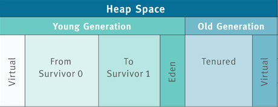

# JVM-3 Java 虚拟机内存结构

# 运行时数据区

在 《Java 虚拟机规范》中用的是「运行时数据区」这个术语。但很多时候并不是很形象。
再加上日积月累的习惯，都习惯用虚拟机内存结构这个说法。
根据 《Java 虚拟机规范》中的说法，Java 虚拟机的内存结构可以分为公有和私有两个部分。
公有是指所有线程都共享的部分，指的是 Java 堆、方法区、常量池。
私有指的是每个线程的私有数据，包括：PC 寄存器， Java 虚拟机栈、本地方法栈。

## 公有部分： Java 堆、方法区、常量池

在 Java 虚拟机中，线程共享的部分包括 Java 堆、方法区及常量池。

Java 堆指的是从 JVM 划分出来的一块区域，这块区域专门用于 Java 实例对象的内存分配，
几乎所有实例对象都会在这里进行内存的分配。之所以说几乎是因为有特殊情况，有些时候
小对象会直接在栈上进行分配，这种现象称之为「栈上分配」。

方法区指的是储存 Java 类字节码数据的一块区域，它存储了每一个类的结构信息，
例如运行时常量池、字段和方法数据、构造方法等。可以看到常量池是存放在方法区中的，
但在 《Java 虚拟机规范》将常量池和方法区放在同一个等级上。

方法区在不同版本的虚拟机有不同的表现形式，在 1.7 版本的 HotSpot 虚拟机中，方法区
被称为永久代（Permanent Space），而在 JDK1.8 中则被称为 MetaSpace。

### Java 堆

Java 堆根据对象存活时间的不同，Java 堆还被分为年轻代、老年代两个区域，年轻代还被
进一步划分为 Eden 区，From Survivor 0、To Survivor 1 区。
见图。

当有对象需要分配时，一个对象永远优先被分配在年轻代的 Eden 区，等到 Eden 区域内存
不够时，Java 虚拟机会启动垃圾回收。此时 Eden 区没有被引用的对象的内存会被回收，
而一些存活较长时间的对象则会进入到老年代。在 JVM 中有一个名为 `-XX:MaxTenuringThreshold`
的参数专门用来设置晋升到老年代所需要经历的 GC 次数，即在年轻代的对象经过了指定次数的 GC 后，
将在下次 GC 时进入老年代。

这里让我们思考一个问题：为什么 Java 堆要进行这样一个区域划分呢？

根据我们的经验，虚拟机中的对象必然有存活时间长的对象，也有存活时间短的对象，
这是一个普遍存在的正态分布规律。
如果我们将其混在一起，那么因为存活时间短的对象有很多，那么势必导致较为频繁的垃圾回收。
而垃圾回收时不得不对所有内存都进行扫描，但其实有一部分对象，它们存活时间很长，
对他们进行扫描完全是浪费时间。因此为了提高垃圾回收效率，分区就理所当然了。

另外一个值得我们思考的问题是：为什么默认的虚拟机配置，Eden：from ：to = 8:1:1 呢？

其实这是 IBM 公司根据大量统计得出的结果。根据 IBM 公司对对象存活时间的统计，
他们发现 80% 的对象存活时间都很短。于是他们将 Eden 区设置为年轻代的 80%，
这样可以减少内存空间的浪费，提高内存空间利用率。

# 私有部分： PC 寄存器、Java 虚拟机栈、本地方法栈

Java 堆以及方法区的数据是共享的，但是有一些部分则是线程私有的。线程私有部分可以分为：
PC 寄存器、Java 虚拟机栈、本地方法栈三大部分。

PC 寄存器，顾名思义 Program Counter 寄存器，指的是保存线程当前正在执行的方法。
如果这个方法不是 native 方法，那么 PC 寄存器就保存 Java 虚拟机正在执行的字节码指令地址。
如果是 native 方法，那么 PC 寄存器保存的值是 `undefined`。
任意时刻，一条 Java 虚拟机线程只会执行一个方法的代码，而这个被线程执行的方法称为该线程的当前方法，
其地址被存在 PC 寄存器中。

Java 虚拟机栈，这个栈与线程同时创建，用来存储栈帧，即存储局部变量与一些过程结果的地方。
栈帧存储的数据包括：局部变量表、操作数栈。

当 Java 虚拟机使用其他语言（例如 C 语言）来实现指令集解释器时，也会使用到本地方法栈。
如果 Java 虚拟机不支持 natvie 方法，并且自己也不依赖传统栈的话，可以无需支持本地方法栈。

# 参考来源

[陈树义的博客](https://www.cnblogs.com/chanshuyi/p/jvm_serial_04_from_source_code_to_machine_code.html)
